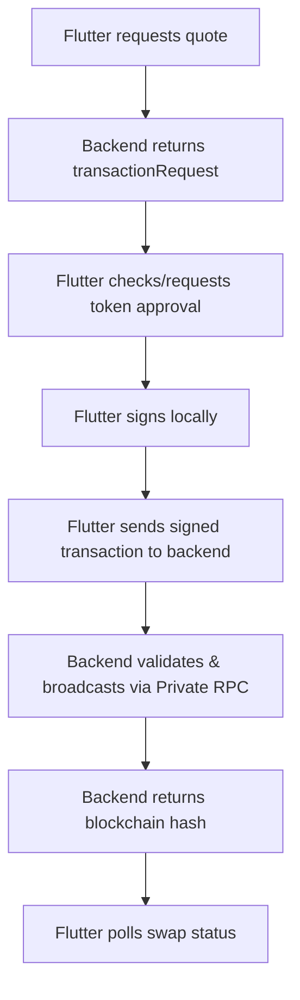

# Swap & Send Integration Plan

## Overview
This plan defines the new architecture for Swaps and Sends in the Cowrie Griot application. The primary objective is to move transaction broadcasting from the client-side RPC (PublicNode) to the backend, ensuring a secure and verifiable flow while keeping private keys strictly on the mobile device.

## New Swap Architecture
The private key never leaves Flutter. The backend only receives the signed transaction bytes.



## 1. Request the Quote
The frontend must provide the source/destination chains and tokens.

**Endpoint**: `POST /api/crypto/swap/quote`
**Required Fields**: `fromChain`, `toChain`, `fromToken`, `toToken`, `fromAmount`, `fromAddress`, `slippageMode: 'custom'`, `slippage`.

> [!IMPORTANT]
> Do not require `quote['transactionId']`. Swap quotes normally do not have a backend preparation UUID at this stage.

## 2. Handle ERC-20 Approval (e.g., HBadge → BNB)
Before swapping, verify the allowance for the `approvalAddress` returned in the quote.

- **Check**: `allowance(userWallet, approvalAddress)`
- **Action**: If allowance is insufficient, initiate an `approve()` transaction.
- **Sign**: Signed locally using `WalletService`.
- **Broadcast**: Must be sent to the backend endpoint (e.g., `POST /api/crypto/swap/broadcast`).
- **Wait**: Confirmation (receipt status 0x1) is mandatory before requesting a fresh quote and executing the swap.

## 3. Validate & Sign Locally
Extract all parameters from `quote.transactionRequest` exactly as returned.

**Required Fields for Signing**:
- `to`, `data`, `value`, `nonce`, `chainId`, `gasLimit`
- Fee fields: `gasPrice` OR (`maxFeePerGas` and `maxPriorityFeePerGas`)

> [!CAUTION]
> The frontend must sign the transaction **exactly** as returned. Do not modify calldata, recipient, or gas parameters.

## 4. Backend Broadcasting
Stop using `WalletRpcService.sendRawTransaction` for the actual swap.

**Endpoint**: `POST /api/crypto/swap/broadcast`
**Payload**:
```json
{
  "network": "bsc",
  "signedTransaction": "0xSignedTransactionHex"
}
```

## 5. Status Polling
Use the returned `hash` as the `transactionId` for status lookups.

**Endpoint**: `GET /api/crypto/swap/status`
**Required Query Params**:
- `transactionId` (the hash)
- `fromAddress`
- `provider` (lifi/0x)
- `fromChain`
- `toChain` (Required for LI.FI)
- `swapType` (same-chain/cross-chain)
- `quoteId` (Required for 0x cross-chain)

## UI Guidelines
1. **Processing State**: Label the broadcasted state as "Processing" or "Confirming", not "Successful".
2. **Success State**: Only show the final Success UI when the status returns `CONFIRMED`.
3. **Failure State**: Show failure if status is `FAILED` or `ERROR`.
4. **Approval Step**: Provide a clear "Approve [Token]" button when allowance is missing.

## Network Constants
Always use the provider-standard native token constant:
`0xEeeeeEeeeEeEeeEeEeEeeEEEeeeeEeeeeeeeEEeE`
